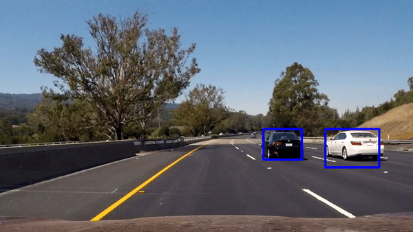
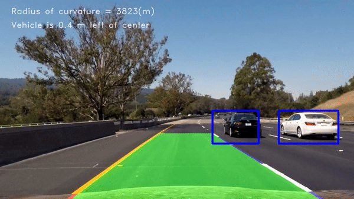

# **Vehicle Detection Project**
### Adalberto Gonzalez

The goals / steps of this project are the following:

* Perform a Histogram of Oriented Gradients (HOG) feature extraction on a labeled training set of images and train a classifier Linear SVM classifier
* apply a color transform and append binned color features, as well as histograms of color, to your HOG feature vector. 
* Implement a sliding-window technique and use your trained classifier to search for vehicles in images.
* Run a pipeline on a video stream (start with the test_video.mp4 and later implement on full project_video.mp4) and create a heat map of recurring detections frame by frame to reject outliers and follow detected vehicles.
* Estimate a bounding box for vehicles detected.

[//]: # (Image References)
[image1]: ./output_images/vehicle_nonvehicle.png
[image2]: ./output_images/hog_example.png
[image3]: ./output_images/sliding_windows.png
[image4]: ./output_images/sliding_windows_mult.jpg
[image5]: ./output_images/output_heatm.png
[image6]: ./output_images/output_lane_line.png

[video1]: ./project_video.mp4

## [Rubric](https://review.udacity.com/#!/rubrics/513/view) Points
###Here I will consider the rubric points individually and describe how I addressed each point in my implementation.  

---
###Writeup / README

####1. Provide a Writeup / README that includes all the rubric points and how you addressed each one.   
You're reading it!

###Histogram of Oriented Gradients (HOG)

####1. Explain how (and identify where in your code) you extracted HOG features from the training images.

The code for this step is contained in block 15 of the code .  

I started by reading in all the `vehicle` and `non-vehicle` images.  Here is an example of one of each of the `vehicle` and `non-vehicle` classes:

![alt text][image1]

I then explored different color spaces and different `skimage.hog()` parameters (`orientations`, `pixels_per_cell`, and `cells_per_block`).  I grabbed random images from each of the two classes and displayed them to get a feel for what the `skimage.hog()` output looks like.

Here is an example using the `YCrCb` color space and HOG parameters of `orientations=9`, `pixels_per_cell=(8, 8)` and `cells_per_block=(2, 2)`:

![alt text][image2]

####2. Explain how you settled on your final choice of HOG parameters.

I tried various combinations of parameters and i decided to choose color_space `YCrCb` ,`HOG orientations 9`,  `HOG pixels per cell 8`, `HOG cells per block 2`, `ALL Hog channels`, `Spatial binning dimensions 32x32` and  `Number of histogram bins 32`. that you can see in the HOG parameters block


####3. Describe how (and identify where in your code) you trained a classifier using your selected HOG features (and color features if you used them).

in the ## Train SVC block you'll see I trained a linear SVM using the parameters that ive previously mentioned 

###Sliding Window Search

####1. Describe how (and identify where in your code) you implemented a sliding window search.  How did you decide what scales to search and how much to overlap windows?

at first i decided to stablish a search region that limits thelower part of the image and a size to have a clear identification and then instead of computing every part intdependently i used the hog feautres of the full image to extract the features and being able to manipulate them regardles of the size

![alt text][image3]

####2. Show some examples of test images to demonstrate how your pipeline is working.  What did you do to optimize the performance of your classifier?

Ultimately I searched on two scales using YCrCb 3-channel HOG features plus spatially binned color and histograms of color in the feature vector, which provided a nice result.  Here are some example images:

![alt text][image4]
---

### Video Implementation

####1. Provide a link to your final video output.  Your pipeline should perform reasonably well on the entire project video (somewhat wobbly or unstable bounding boxes are ok as long as you are identifying the vehicles most of the time with minimal false positives.)


[](https://youtu.be/7_-6SmQauxw)

##### And here is the test video including the lane lines detection

[](https://youtu.be/kqQkgcQ4rwU)


####2. Describe how (and identify where in your code) you implemented some kind of filter for false positives and some method for combining overlapping bounding boxes.

I recorded the positions of positive detections in each frame of the video.  From the positive detections I created a heatmap and then thresholded that map to identify vehicle positions.  I then used `scipy.ndimage.measurements.label()` to identify individual blobs in the heatmap.  I then assumed each blob corresponded to a vehicle.  I constructed bounding boxes to cover the area of each blob detected.  

Here's an example result showing the heatmap from a series of frames of video, the result of `scipy.ndimage.measurements.label()` and the bounding boxes then overlaid on the last frame of video:

### Here you can see heatmaps applied:

![alt text][image5]


### Here the resulting bounding boxes are drawn onto the last frame in the series incuding Lane detection:
![alt text][image6]


---

###Discussion

####1. Briefly discuss any problems / issues you faced in your implementation of this project.  Where will your pipeline likely fail?  What could you do to make it more robust?

this code has a lot of room to improve we can work the bumpiness of the frames by getting loweing the number of samples on the video or get an average from every frame, also we can reduce the false positives by adjusting the region of interest and working with multiple heatmaps even add notes to identify the vehicle detected and many more

As you could see this projet is far from being completed because even when i feel i completed the task, there is a enormous oportunity to growth and improvement, i hope i can come back to this project to improve on my thoughts on new learnings!.  


```python

```
